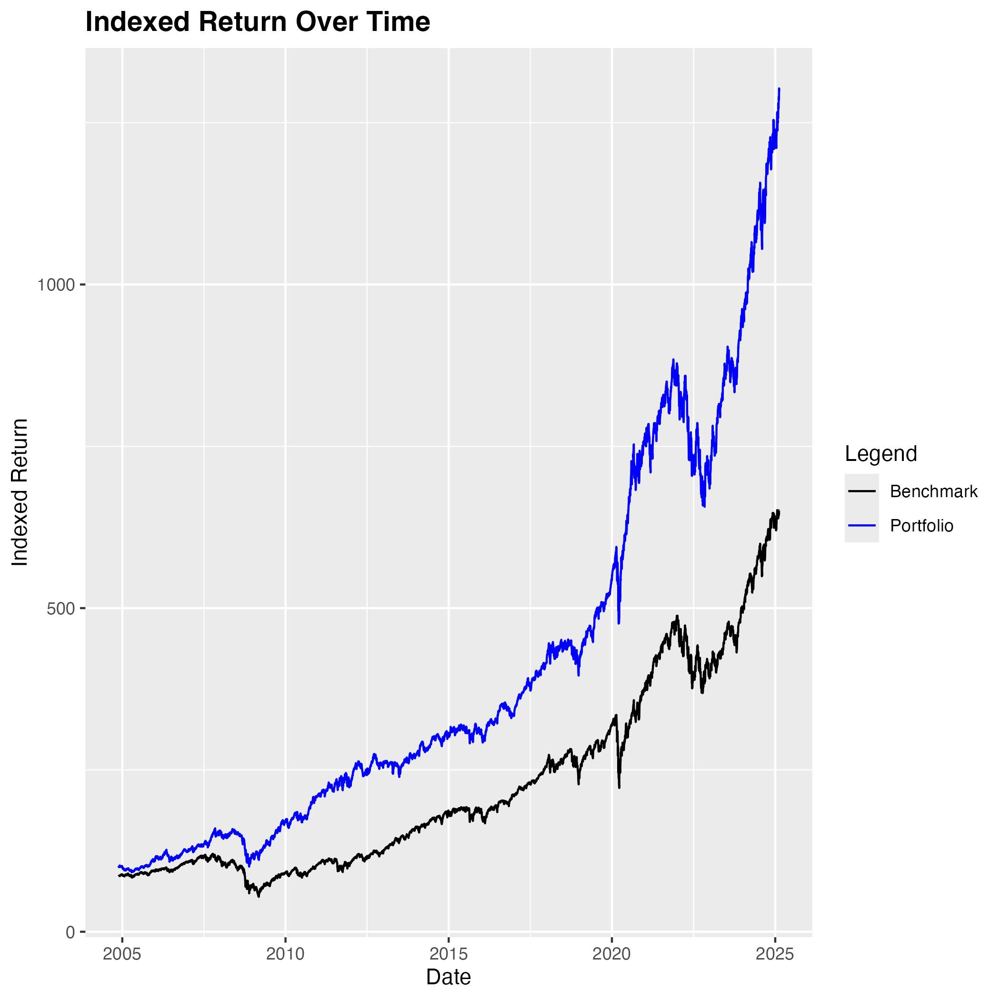
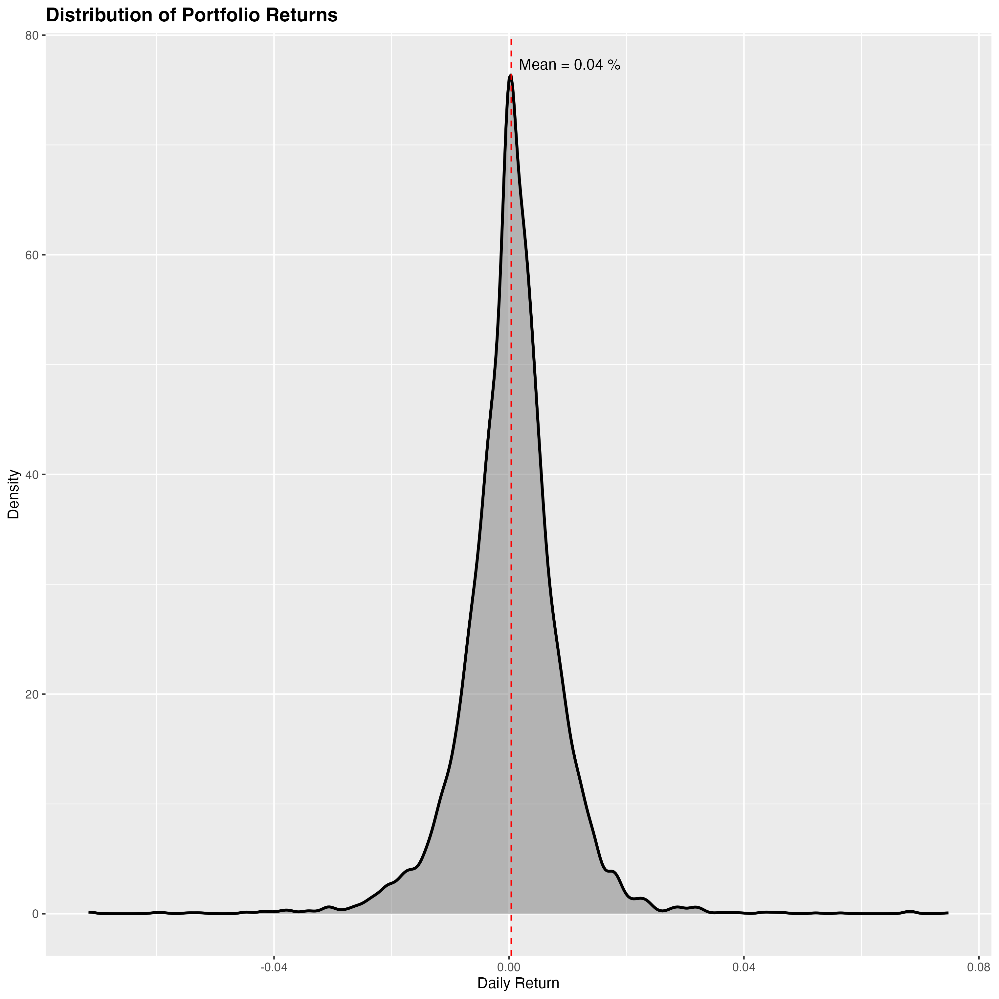
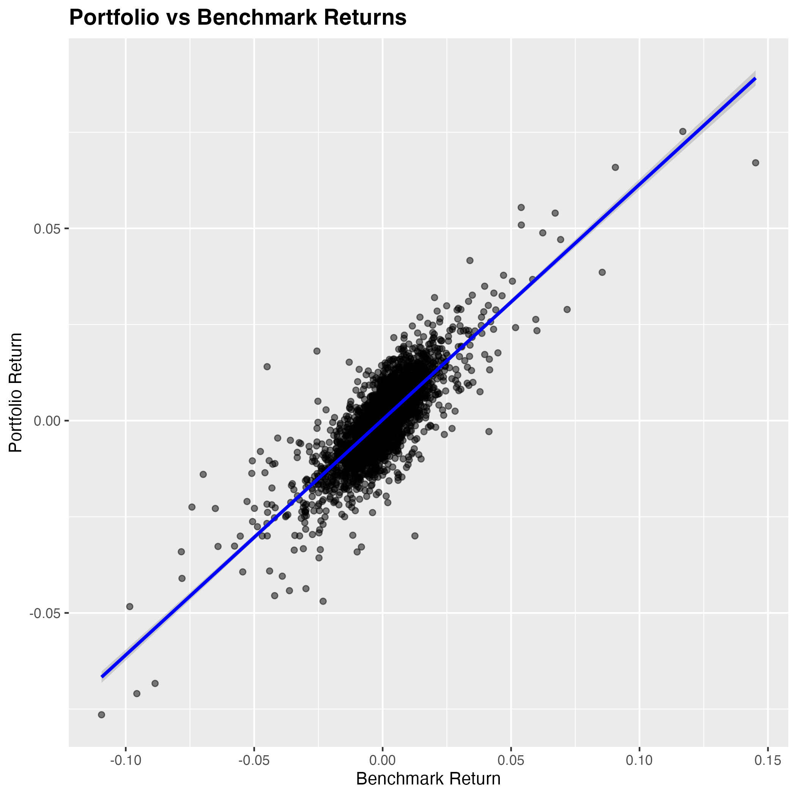
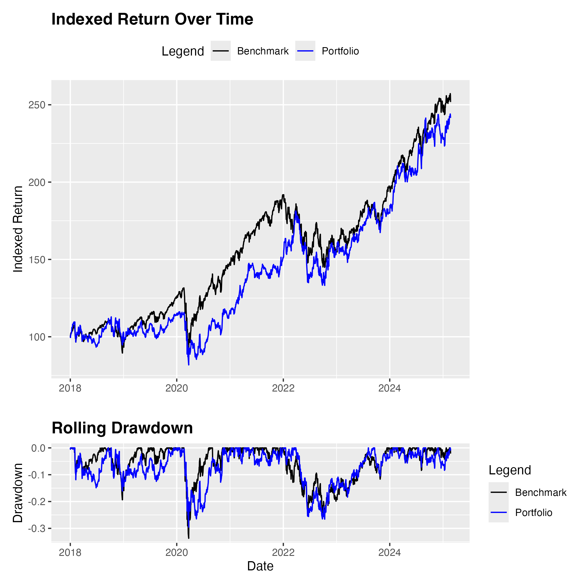

# Portfolio Backtesting Engine 💼

## Overview
This project implements a modular portfolio backtesting engine in R, designed for reusability across different investment strategies while maintaining a consistent analytical framework. The engine processes historical financial data, applies configurable strategies, and benchmarks portfolio performance.

## Modular Design
1. **Data Handling**
   - Retrieves historical stock, ETF, and bond data from a PostgreSQL database.
   - Aligns asset start dates to ensure consistency (`align_dates()`).

2. **Strategy Integration**
   - Supports plug-and-play strategy modules (`apply_strategy()`).
   - Allows easy modification of asset allocations and investment logic without altering the core engine.

3. **Backtesting & Performance Evaluation**
   - Computes portfolio returns and cumulative performance (`run_backtest()`).
   - Benchmarks portfolio performance against a reference index.
   - Calculates key financial metrics:
     - **CAGR** (Compound Annual Growth Rate)
     - **Annualized Volatility**
     - **Sharpe Ratio**
     - **Max Drawdown**
     - **Sortino Ratio**
     - **Calmar Ratio**

4. **Risk Analysis & Visualization**
   - Computes portfolio and benchmark drawdowns (`compute_drawdown()`).
   - Generates key plots:
     - **Indexed Return Over Time** 
     - **Rolling Drawdown** 
     - **Returns Distribution** 
     - **Portfolio vs. Benchmark Scatter Plot** 
     - **Combined Indexed Return & Drawdown** 

## Key Benefits
- **Modular & Reusable**: Swap in different strategy functions without modifying the engine.
- **Scalability**: Designed to handle multiple assets and benchmarks efficiently.
- **Consistent Evaluation**: Standardized performance metrics across different strategies.

This engine provides a flexible foundation for testing and optimizing various portfolio strategies with minimal changes to the core system.